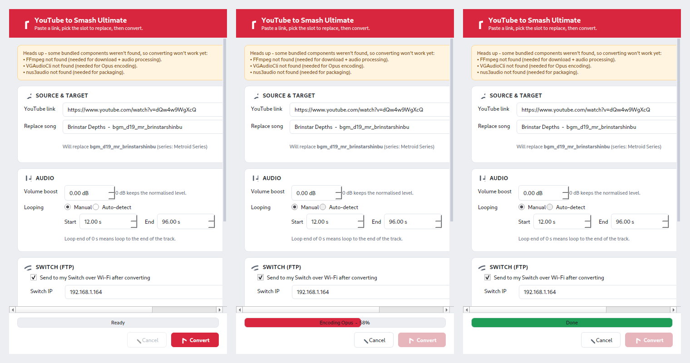

<div align="center">

# YouTube to Smash Ultimate

**Turn any YouTube link into a Super Smash Bros. Ultimate music mod — pick the slot, set your loop, convert, and send it straight to your Switch.**

[](https://github.com/oriaharo-creator/YouTube-to-Smash-Ultimate/releases/latest)
[](https://github.com/oriaharo-creator/YouTube-to-Smash-Ultimate/actions/workflows/build.yml)
[](LICENSE)
[](#install)
[](https://github.com/oriaharo-creator/YouTube-to-Smash-Ultimate/releases)



</div>

> **This tool ships no copyrighted audio.** You supply your own source links.
> Respect content owners' rights and the terms of any service you download from.
> Not affiliated with or endorsed by Nintendo. Super Smash Bros. Ultimate is a
> trademark of Nintendo.

---

## What it does

Replacing a song in Smash Ultimate normally means juggling several command-line
tools, a cryptic list of internal track IDs, exact loop-point math, and a very
specific audio format the Switch will accept. **YouTube to Smash Ultimate** wraps
that whole pipeline behind one window: paste a link, search for the song you want
to replace by name, set a loop, and click **Convert**. Out comes a ready-to-use
`.nus3audio` file for the [ARCropolis](https://github.com/Raytwo/ARCropolis) mod
loader — optionally uploaded to your Switch over Wi-Fi or to your SD Card.

## Features

- **Search 1,137 BGM slots by name**, not by cryptic ID — pick *Brinstar Depths*,
  not `bgm_d19_mr_brinstarshinbu`.
- **One-click conversion** to the exact format Smash needs: 48 kHz / 16-bit
  stereo, CBR Namco-Opus with 48-sample-aligned loop points.
- **Match game volume** automatically (EBU R128 loudness match to vanilla BGM),
  or set a manual boost.
- **Manual or whole-track looping**, snapped to zero-crossings to avoid clicks.
- **Three ways to deploy**: just save the file, copy into a local mod folder
  (e.g. a mounted SD card), or **FTP straight to your Switch** over Wi-Fi.
- **A record of every slot you've modded**, with a warning before you overwrite.
- **Self-installing components** — missing encoders are downloaded on first run.
- **A friendly GUI *and* a scriptable CLI** that share one backend, so they can
  never behave differently.

## Install

### Windows

1. Download **`YouTubeToSmash-Setup.exe`** from the
   [latest release](https://github.com/oriaharo-creator/YouTube-to-Smash-Ultimate/releases/latest).
2. Run it (a per-user install — no admin prompt) and launch
   **YouTube to Smash Ultimate** from the Start Menu.

FFmpeg and the encoders are bundled. The Opus encoder (VGAudio) is a .NET
program, so it needs Microsoft's free **.NET runtime** — most Windows PCs already
have it. If a conversion stops with a message about .NET, install the
**[.NET Desktop Runtime](https://dotnet.microsoft.com/download)** and try again.

### Linux / Ubuntu

```bash
sudo apt update
sudo apt install libegl1 libxkbcommon0 libxcb-cursor0 mono-complete
# then grab the Linux tarball from the latest release:
tar -xzf YouTubeToSmash-*-linux-x86_64.tar.gz
./YouTubeToSmash/YouTubeToSmash
```

*(Optional)* add a menu entry with `./YouTubeToSmash/install.sh`.

## Using it

1. Paste a YouTube link.
2. Start typing a song name and pick the slot to replace (e.g. *Brinstar Depths*).
3. Set the loop **Start**/**End** in seconds, or choose **Whole track**.
4. Choose where it goes: save it, copy it into a mod folder, or
   **Send to my Switch over Wi-Fi** (enter the IP shown in your ftpd app and your
   mod folder name).
5. Click **Convert**.

To place files on your Switch manually, copy the generated `.nus3audio` to:

```
sd:/ultimate/mods/<YourModFolder>/stream;/sound/bgm/<bgm_id>.nus3audio
```

### Command line

A console build (`yt2smash-cli`) ships alongside the GUI:

```bat
yt2smash-cli "https://youtu.be/VIDEO" bgm_d19_mr_brinstarshinbu ^
    --loop-start 12 --loop-end 96 -o C:\mods\out

yt2smash-cli --check        :: verify the bundled tools are present
yt2smash-cli --list-mods    :: show every slot you've modded
yt2smash-cli "https://youtu.be/VIDEO" bgm_... --ftp 192.168.1.164 --mod-name MyPack
```

Run `yt2smash-cli --help` for the full set of options.

## How it works

A single backend module (`backend.py`) is the source of truth for the pipeline;
the GUI (`app.py`) and CLI (`cli.py`) both call it, so their behaviour can never
drift. The stages:

1. **Download** the best audio stream (yt-dlp).
2. **Normalise** to 48 kHz / 16-bit / stereo — either a two-pass EBU R128
   loudness match to vanilla Smash BGM, or a manual peak-normalise + gain
   (FFmpeg / pydub).
3. **Resolve loop points** — manual, or whole-track — snapped to a zero-crossing
   and aligned to the Switch decoder's 48-sample Opus block boundary (NumPy).
4. **Encode** to `.lopus` with a Namco header at CBR 64 kbps (VGAudio).
5. **Package** into a `.nus3audio` container (nus3audio-rs).
6. **Deploy** (optional) — FTP to the Switch or copy into a local mod folder.

Failures raise specific, typed exceptions that the GUI maps to plain-language
dialogs, and the GUI design follows Shneiderman et al., *Designing the User
Interface* (6th ed.) — each interaction choice in `app.py` cites the principle it
implements.

```
app.py            GUI (PySide6)
cli.py            command-line front end
backend.py        conversion pipeline (shared source of truth)
tooldl.py         runtime downloader for the bundled tools
ledger.py         record of modded slots + overwrite checks
data/             songlist.json (the 1,137 BGM slots)
bin/              bundled tools (not committed — fetched at build/runtime)
yt2smash.spec     PyInstaller build spec
installer/        Inno Setup installer script
.github/          CI workflow, issue/PR templates
```

## Build from source

PyInstaller can't cross-compile, so build each platform on that platform, with
**Python 3.11 or 3.12** (not 3.13+ — `pydub` needs the `audioop` module removed
in 3.13). Full details are in [`PACKAGING.md`](PACKAGING.md).

**Windows** — just double-click **`build_windows.bat`**. It finds Python, installs
the build dependencies, **auto-downloads** the bundled tools, freezes the app, and
(if [Inno Setup 6](https://jrsoftware.org/isdl.php) is installed) builds the
installer. Outputs: `dist\YouTubeToSmash\` and
`installer\Output\YouTubeToSmash-Setup.exe`.

**Linux / Ubuntu** — `./build_linux.sh` produces `dist/YouTubeToSmash/` and a
tarball.

To run from source without freezing (any OS with the tools on PATH):

```bash
pip install PySide6 yt-dlp pydub numpy
python app.py        # GUI
python cli.py --help # CLI
```

## Troubleshooting

Common fixes — full guide in [`TROUBLESHOOTING.md`](TROUBLESHOOTING.md):

- **"A required component is missing"** → let the in-app installer finish, or run
  `yt2smash-cli --check`.
- **A message about .NET / the Opus encoder won't run** → install the free
  [.NET Desktop Runtime](https://dotnet.microsoft.com/download).
- **"Couldn't reach your Switch"** → start the ftpd FTP server on the Switch and
  confirm the IP and that you're on the same Wi-Fi.
- **The mod is silent or the wrong song plays in-game** → see
  [Troubleshooting](TROUBLESHOOTING.md#in-game-problems).

## Contributing

Issues and pull requests are welcome — see [`CONTRIBUTING.md`](CONTRIBUTING.md).
Good first contributions: more BGM metadata, additional deploy targets, and
loop-detection improvements.

## Credits & licenses

MIT-licensed (see [`LICENSE`](LICENSE)). Built on
[yt-dlp](https://github.com/yt-dlp/yt-dlp),
[FFmpeg](https://ffmpeg.org),
[VGAudio](https://github.com/Thealexbarney/VGAudio),
[nus3audio-rs](https://github.com/jam1garner/nus3audio-rs),
[PySide6](https://pypi.org/project/PySide6/), pydub and NumPy — each under its own
license; see [`THIRD_PARTY_LICENSES.md`](THIRD_PARTY_LICENSES.md). Thanks to the
Smash Ultimate modding community, especially the
[ARCropolis](https://github.com/Raytwo/ARCropolis) team and the maintainers of the
[modding documentation](https://coolsonickirby.github.io/Smash-Ultimate-Documentation/).

Maintained by [@yoavaharonofficial](https://github.com/yoavaharonofficial) and
[@oriaharo-creator](https://github.com/oriaharo-creator).
